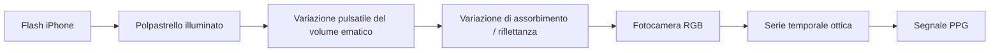
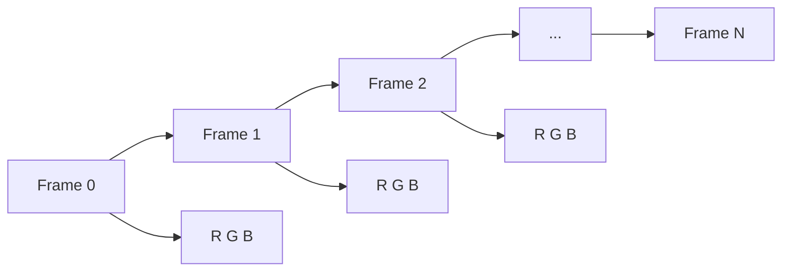
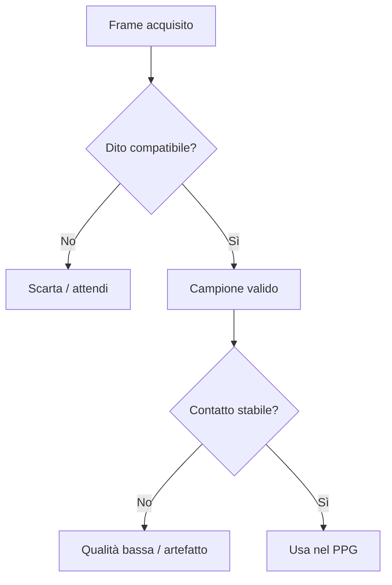
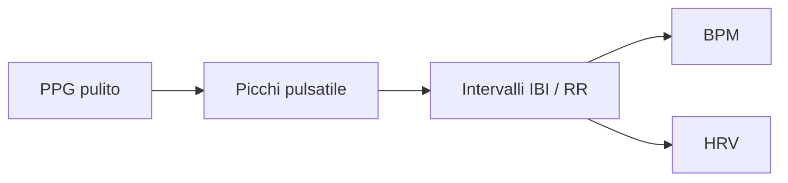
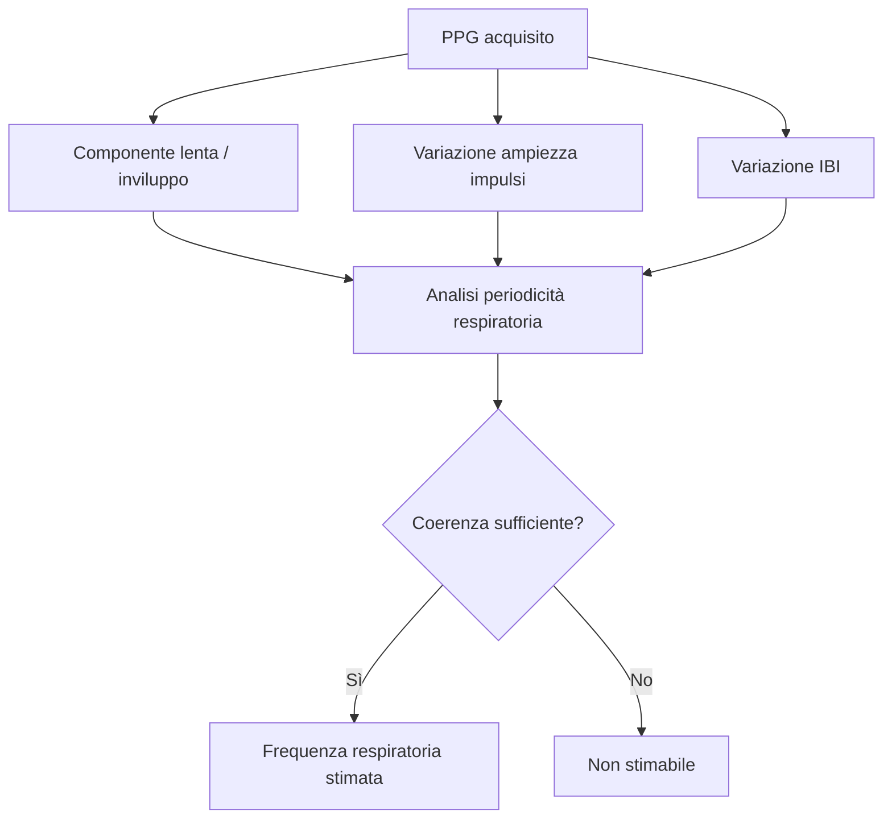
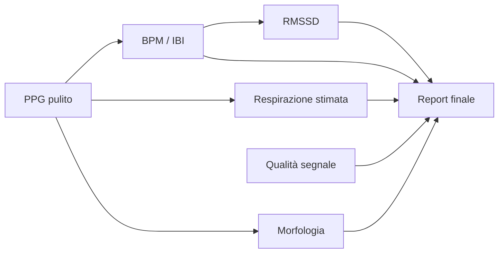

# Eris Pulse Lab — Clinical Rationale

**Versione di riferimento:** v0.4  
**Scopo:** spiegare in modo clinicamente leggibile come i dati vengono ottenuti dalla fotocamera + flash di iPhone e quali passaggi separano il segnale ottico primario dalle feature derivate.

> Eris Pulse Lab è un prototipo esplorativo di analisi PPG e non è un dispositivo medico certificato.

---

# Pagina 1/2 — Dalla luce al segnale PPG

## 1. Principio fisiologico

Il flash illumina il polpastrello. Una parte della luce viene assorbita e una parte ritorna verso la fotocamera. A ogni sistole il volume di sangue presente nei piccoli vasi cutanei aumenta; durante la fase successiva diminuisce. Questo modifica leggermente la quantità di luce registrata.



**Dato realmente osservato:** intensità luminosa dei pixel nel tempo.  
**Interpretazione fisiologica:** componente pulsatile correlata alla variazione di volume sanguigno periferico.

## 2. Acquisizione

Durante una sessione di 60 secondi l'app registra una sequenza di frame dalla fotocamera posteriore con torcia attiva.

Per ogni frame vengono conservati:

- tempo di acquisizione;
- valori medi R, G e B della regione analizzata;
- luminosità media;
- FPS effettivi;
- stato di presenza del dito.



## 3. Controllo del contatto

Prima di usare il segnale, l'app verifica che l'immagine abbia caratteristiche compatibili con un dito illuminato dal flash.

Controlli principali:

1. prevalenza della componente rossa;
2. luminosità minima;
3. assenza di saturazione estrema;
4. continuità del contatto;
5. stabilità del segnale nel tempo.

Se il dito viene perso per un intervallo prolungato, la misura viene interrotta invece di produrre un valore artificiale.



## 4. Costruzione della curva PPG

Per ogni frame viene calcolato un valore ottico sintetico a partire dai canali RGB. La sequenza dei valori forma una curva nel tempo.

La curva contiene:

- una componente lenta, legata a illuminazione, pressione del dito e variazioni non pulsatile;
- una componente pulsatile, sincronizzata con il ciclo cardiaco;
- rumore e artefatti.

```text
Segnale osservato = componente lenta + componente pulsatile + rumore
```

## 5. Pre-processing

La curva viene regolarizzata temporalmente e filtrata per rendere più evidente la componente pulsatile.

Passaggi principali:

- risincronizzazione dei campioni secondo gli FPS reali;
- rimozione della baseline lenta;
- smoothing leggero;
- normalizzazione rispetto alla variabilità del segnale;
- esclusione delle finestre troppo instabili.


**Output della pagina 1:** un segnale PPG continuo, con qualità stimata, pronto per estrarre pulsazioni e feature fisiologiche.

---

# Pagina 2/2 — Dal PPG ai parametri del report

## 6. Frequenza cardiaca e intervalli IBI / RR

Il sistema cerca la periodicità dominante del PPG e identifica i picchi pulsatile.

Tra due picchi consecutivi viene calcolato l'intervallo temporale IBI/RR.

```text
BPM ≈ 60 / intervallo medio tra pulsazioni espresso in secondi
```

Da questi dati vengono riportati:

- BPM medio;
- BPM minimo;
- BPM massimo;
- RR / IBI mediano;
- trend BPM nel tempo.



## 7. Come viene stimata la respirazione

La respirazione **non viene osservata direttamente** dalla fotocamera. Viene dedotta perché il respiro può modulare lentamente il PPG.

Tre effetti noti possono contribuire:

### A. Modulazione della baseline

Inspirazione ed espirazione possono spostare lentamente la linea di base del segnale PPG.

```text
PPG rapido:       /\  /\  /\  /\  /\
Inviluppo lento: ~~~~~~~~~~~~~~~~
```

### B. Modulazione dell'ampiezza

L'ampiezza dei singoli impulsi può aumentare e diminuire durante il ciclo respiratorio.

### C. Modulazione degli intervalli

La respirazione può modificare leggermente il tempo tra battiti attraverso la modulazione cardiaca respiratoria.

Eris Pulse Lab cerca quindi una **oscillazione lenta coerente** sovrapposta al segnale cardiaco, nella banda compatibile con circa **6–30 atti/min**.



**Importante:** è una stima indiretta PPG-derived. Non equivale a spirometria, capnografia o misura respiratoria certificata.

## 8. HRV — RMSSD

Dalla sequenza degli intervalli IBI/RR si osserva quanto varia il tempo tra un battito e il successivo.

RMSSD utilizza le differenze successive tra intervalli consecutivi ed è una metrica di variabilità a breve termine.

```text
RR1 → RR2 → RR3 → RR4
 |Δ1|  |Δ2|  |Δ3|
       ↓
     RMSSD
```

Con una registrazione di 60 secondi il report privilegia metriche brevi; metriche HRV che richiedono registrazioni più lunghe non vengono interpretate come equivalenti a protocolli standard di 5 minuti.

## 9. Morfologia del polso

Quando FPS e qualità sono sufficienti, dalla forma relativa dell'onda si possono estrarre feature geometriche.

```text
                   picco
                    /\
                   /  \____
 baseline ________/        \____
          <rise>  <--- width --->
```

Il report può tentare di ricavare:

- **tempo di salita:** dal piede dell'onda al picco;
- **larghezza impulso:** larghezza a metà ampiezza;
- **pulsatilità ottica AC/DC:** rapporto relativo tra componente pulsatile e livello ottico medio;
- **notch dicroto:** screening solo se una struttura compatibile è rilevata in modo consistente.

Questi parametri sono **relativi/esplorativi**, non misure vascolari assolute validate.

## 10. Qualità e regola di non-invenzione

Ogni feature è subordinata alla qualità del segnale.

Se l'informazione non è sufficiente, il sistema riporta:

> **Non stimabile**

invece di creare un valore numerico.

## 11. Eris Physiological Report

Il report finale può contenere:

### Parametri primari / più difendibili

- BPM medio, minimo, massimo;
- RR / IBI mediano;
- RMSSD breve termine;
- PPG completo e trend;
- qualità segnale, FPS e percentuale di campioni validi.

### Parametri derivati

- frequenza respiratoria stimata + confidenza;
- tempo di salita relativo;
- larghezza impulso relativa;
- pulsatilità ottica AC/DC;
- screening del notch dicroto.

### Parametri volutamente esclusi

- pressione arteriosa in mmHg;
- SpO₂ come misura diretta dalla sola fotocamera;
- diagnosi;
- decisioni terapeutiche.



## Messaggio sintetico per il clinico

Eris Pulse Lab usa la fotocamera come sensore ottico PPG. Il dato primario è la variazione temporale della luce riflessa/trasmessa dal polpastrello. Frequenza cardiaca e intervalli derivano dalla periodicità del segnale; respirazione e morfologia sono feature indirette del PPG e vengono riportate solo quando la qualità è sufficiente. Il sistema è pensato per ricerca, trend e confronto intra-soggetto, non per sostituire dispositivi certificati.
